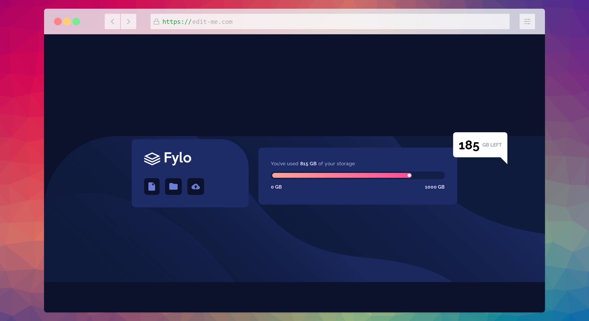

## Overview

## Time: ~3hrs

### The challenge

Users should be able to:

- View the optimal layout for the site depending on their device's screen size

TODO: Add screenshot here! Use Chrome Dev Tools ctrl+shift+p screenshot full page. Or more preferably use screenshot.rocks

[Solution](https://fm-2-fylo-data-storage-component.pages.dev/)

## Built with

- Svelte Kit + static adapter
- Tailwind CSS (JIT mode)
- Cloudflare pages

### What I learned

- I find it intriguing that I didn't have to adjust any of the markup moving to desktop dimensions. Though it might have been better if I did.
- Recalled some stuff from my notes. Especially the tooltip. I rotated the corner of it 90degs and it... just worked, surprisingly. Also reviewed background properties and recalled that the shorthand is bad practice if you plan to override any of its individual properties later (which is likely, and happened here).
- Interestingly, I realized that when you begin styling desktop dimensions, styling from the inside-out (bottom-up) is significantly easier than top-down. After that realization, things proceeded very very quickly, and I plan to apply this process to components, too.

### Continued development

- I should better understand positions, as this current layout, especially the background, can break easily by resizing dimensions. It's definitely inflexible, but it works. To be fair, I have never covered positions in great depth and understand them from a surface level (some courses cover them but they don't give tons of real-world situations for dealing with common edge cases).
- Perhaps, an improvement would add more markup instead of simply styling the `main` element. I definitely should have more containers next time. I realized I have a bad habit that makes me avoid adding markup because I feel unnecessary markup could clutter up stuff, but instead I end up adding insufficient markup.

### Useful resources

- [CSS In-Depth v2](https://frontendmasters.com/courses/css-in-depth-v2/) - I reviewed my notes and remembered this covered background properties (the bad practice of the shorthand) and the tooltip with :after pseudo-elements. Many of the slides were very helpful as a quick cheat-sheet, and there were some good examples that allowed me to quickly arrive at my solution, even if they required some tweaking.
